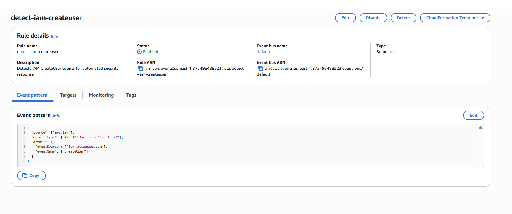
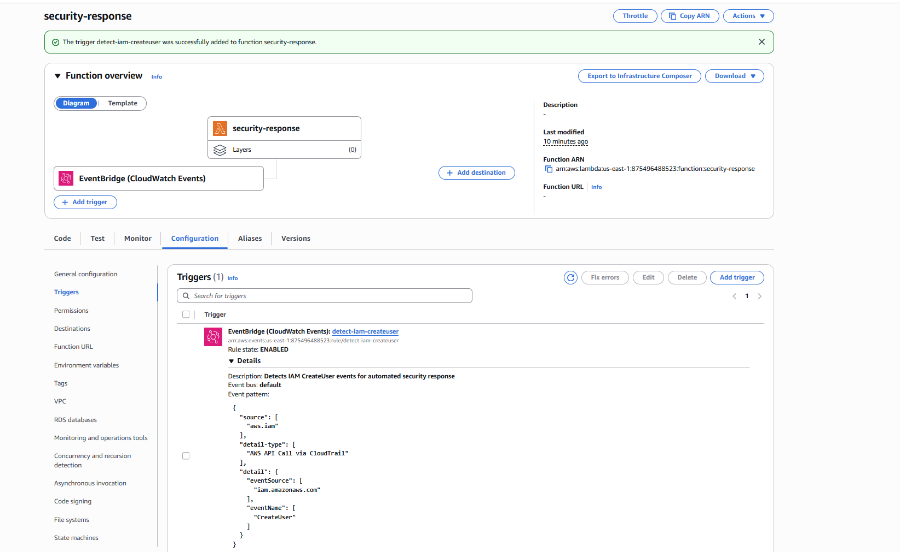
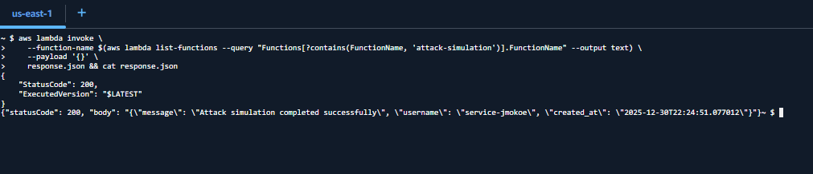
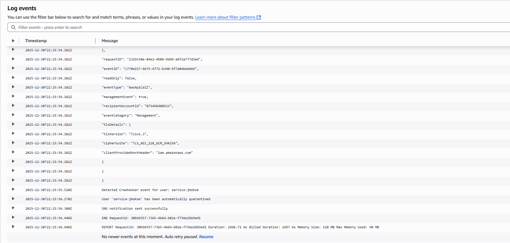
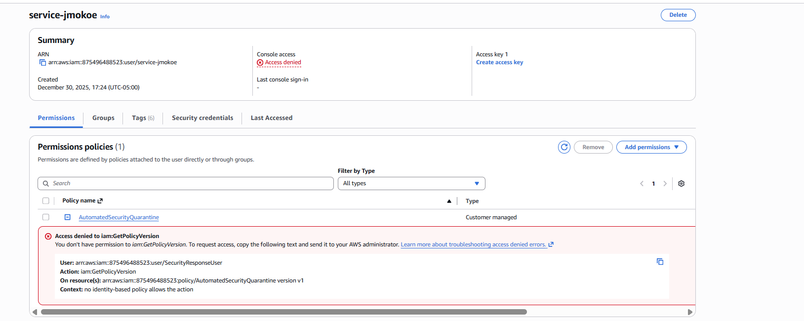

# Automated AWS Incident Response: Real-Time IAM Identity Quarantine

## Executive Summary

This project implements a serverless Security Orchestration, Automation, and Response (SOAR) workflow designed to detect and contain identity-based threats in near real-time. By leveraging AWS EventBridge and Lambda, the system monitors CloudTrail logs for suspicious IAM `CreateUser` events and automatically isolates the newly created identity before potential malicious activity can occur.

The solution replaces manual, high-latency SOC intervention with an automated "detect-and-respond" pattern. Upon detection of an unauthorized user creation, the system triggers a remediation function that attaches a deny-all quarantine policy and alerts the security team via SNS, reducing the Time to Contain (TtC) from minutes or hours to milliseconds.

---

## Technology Stack

* **Compute & Orchestration:** AWS Lambda (Python 3.9), AWS EventBridge (Rules & Patterns)
* **Security & Identity:** AWS IAM (Policies, Users, Roles), AWS CloudTrail
* **Infrastructure as Code:** CloudFormation / Python Boto3
* **Monitoring & Notification:** Amazon CloudWatch Logs, Amazon SNS

---

## Architecture & Workflow

The following diagram illustrates the event-driven architecture. The workflow is completely serverless, relying on asynchronous event buses to decouple detection logic from response execution.

  
   
  <b>Figure 1: High-Level Architecture</b>
    
  Threat detection moves from the left (Actor action) through the Control Plane (IAM/CloudTrail) to the Response Engine (EventBridge/Lambda), resulting in immediate identity quarantine.

---

## Implementation Phases

### Phase 1: Detection Logic (EventBridge)

The core of the detection layer is an EventBridge rule configured to listen for specific management events. Instead of a broad catch-all, I defined a precise event pattern filtering for `CreateUser` API calls originating specifically from the `iam.amazonaws.com` event source.

  
   
  <b>Figure 2: Precision Detection Configuration</b>
    
  The JSON event pattern used to filter the high-volume CloudTrail stream, isolating only the specific API calls that warrant an automated response.

### Phase 2: Workflow Orchestration

To operationalize the logic, I wired the EventBridge rule directly to a Python-based Lambda function. This trigger ensures that the moment a matching event hits the bus, the remediation code is invoked.

  
   
  <b>Figure 3: Event Wiring Validation</b>
    
  Validating the integration between the EventBridge detection rule and the downstream security-response Lambda function.

### Phase 3: Attack Simulation

To test the system under realistic conditions, I deployed a separate `attack-simulation` Lambda function. This function mimics a threat actor or compromised internal script attempting to create a backdoor IAM user (`service-jmokoe`) to bypass standard provisioning controls.

  
   
  <b>Figure 4: Adversary Simulation</b>
    
  Invoking the attack-simulation Lambda from CloudShell to generate a live "Unauthorized User Creation" event in the environment.

### Phase 4: Automated Response & Logging

Upon receiving the signal, the `security-response` Lambda parsed the CloudTrail payload, extracted the target username, and executed the quarantine logic. CloudWatch logs confirm the sequence: detection, policy attachment, and notification delivery.

  
   
  <b>Figure 5: Operational Telemetry</b>
    
  CloudWatch logs verifying the successful execution of the remediation logic, including the specific user targeted and the resulting SNS alert.

The Lambda function automatically publishes an alert to an SNS topic, which is immediately delivered to the security operations team.

  
   
  <b>Figure 6: Automated Security Notification</b>
    
  An example of the email alert delivered via SNS, providing critical context about the quarantined user, the action taken, and the source event details.

### Phase 5: Containment Verification

The final step was verifying the effectiveness of the quarantine. Inspecting the created user in the IAM console confirms that the `AutomatedSecurityQuarantine` policy was successfully attached. The "Access denied" errors visible in the console prove that the policy immediately neutralized the user's ability to perform actions.

  
   
  <b>Figure 7: Containment Validation</b>
    
  The target IAM user (`service-jmokoe`) shows the attached quarantine policy and active permission denials, proving the response was effective.

---

## Root Cause & Threat Model

* **Threat Vector:** Compromised credentials or malicious insiders often create "backdoor" IAM users to establish persistence outside of the primary federated identity provider (IdP).
* **Operational Gap:** Manual log review is too slow. By the time a SOC analyst notices a new admin user in the logs, data exfiltration or destruction may have already occurred.
* **Solution:** Automated, policy-based quarantine reduces the window of opportunity for the attacker to near-zero.

---

## Conclusion

This project demonstrates the power of **Event-Driven Security**. By shifting from reactive log analysis to proactive event filtering and automated response, organizations can enforce immutability in their identity layer. The system provides a scalable, 24/7 guardrail that ensures any deviation from standard provisioning processes is immediately detected and neutralized without human intervention.
